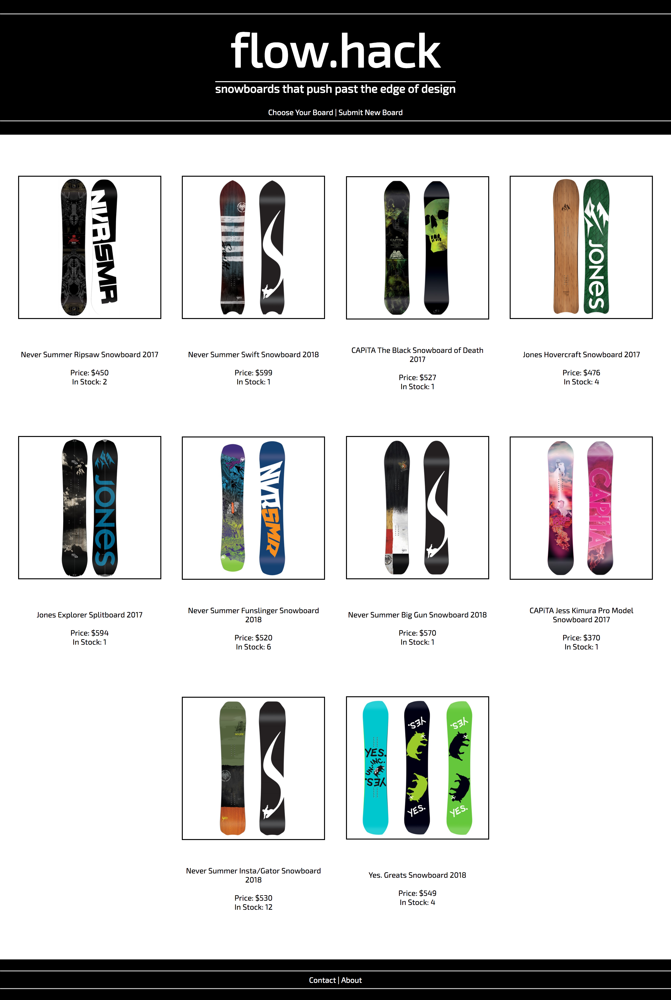
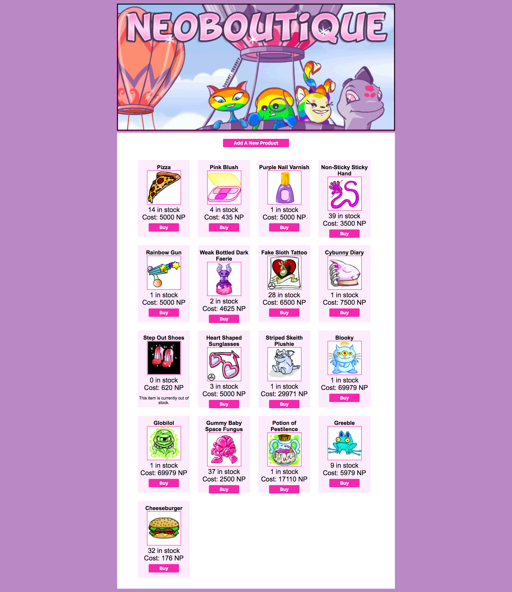

# Full Stack Store App

This application should adhere to the guidelines and rubric presented in the [Full Stack Personal Portfolio Project](https://github.com/pursuit-curriculum/project-full-stack-portfolio)

This readme is an example of how one could implement all the features required for the project when the theme is an online store.

The store will filled with products. Choose any theme you want:

- Soup
- Collectable rubber bands
- $1000 Store (no items worth less than $1000)

Or anything else you want.

## Overview

- Use express & postgres/pg-promise to build a back-end
- Use create-react-app to build a front-end
- Connect the back-end and front-end
- Deploy the project online
- Have a 1:1 interview with an instructor

## Sumission

- Be sure to have a README.md for this project. In the README.md
  - At minimum, include links to your live front-end and back-end
  - Submit the GitHub mono-repository URL to Canvas

## User Stories, Acceptance Criteria and Code Quality Rubric

### User Stories

The user stories encompass both back-end and front-end implementation:

1. A user can see a list of products to buy
1. A user can click on a product and see a detailed view
1. A user can click on the new button that takes me to a new form that lets the user create a new product
1. After clicking the submit button on the new form, it takes the user to a view that confirms the product has been created
1. A user can click on a button to see a pre-filled edit form and edit a product
1. After editing the product, a user is taken to a view that confirms the product has been updated
1. A user can delete a product
1. A user can visit this app from a provided URL on the internet that uses data from the express API

1. A user can [choose one bonus below]

### Acceptance Criteria

### General

- Your own GitHub repository with your code uploded to it. The file structure of your project should match what you learned in the class.
- GitHub readme file that has installation instrctions for your application.
- Daily commits to GitHub.
- The project has a coherent theme and narrative.

### Overall Project Quality

You will also be graded on:

- Code quality
- Application design
- UX/UI
- Application presentation
- Technical innovation

#### Back-end

- An app that uses `express`, and `pg-promise`, where it uses a `postgres` database
- The app is deployed on heroku and can be accessed from your React front-end app and Postman
- The back-end follows a RESTful pattern

Other files and folders required for full functionality of your app

|  #  | Action  |      URL      | HTTP Verb |    CRUD    |                Description                |
| :-: | :-----: | :-----------: | :-------: | :--------: | :---------------------------------------: |
|  1  |  Index  |   /products   |    GET    |  **R**ead  |   Get a list (or index) of all products   |
|  2  |  Show   | /products/:id |    GET    |  **R**ead  | Get an individual view (show one product) |
|  3  | Create  |   /products   |   POST    | **C**reate |           Create a new product            |
|  4  | Destroy | /products/:id |  DELETE   | **D**elete |             Delete a product              |
|  5  | Update  | /products/:id |    PUT    | **U**pdate |             Update a product              |

 

The model will have, at minimum, these following attributes

- `name` - a string, required
- `description` - a string
- `price` - a number
- `rating` - a number between 0 and 5
- `featured` - a boolean

Consider:

- adding a url for an image
- color
- dimensions/size

Or anything else that makes sense for your store.

#### Front-End

1. Is deployed online (ie on Netlify)
1. Allows users to perform full CRUD and uses all routes built for the back-end.
1. The application follows a RESTful pattern.

#### Interview Requirements

1. In a meeting with an instructor or volunteer, you should be able to describe the application's theme and purpose and relate your application to your interests or personal narrative.
1. In a meeting with an instructor or volunteer, you should be able to demonstrate a front-end feature and describe the code in technical terms.
1. In a meeting with an instructor or volunteer, you should be able to demonstrate a back-end feature and describe the code in technical terms.

## Deployment Details

[Use this template](https://github.com/joinpursuit/pern-final-project-template) - deploy the boilerplate app as the first thing you do.

Once the apps are deployed and working as expected:

- Submit your link to Canvas immediately
- You will not be graded until the due date/time

## Bonuses - You MUST Implement one bonus that you have not used in a prior lab or assignment:

- Use Bootstrap or Bootstrap React Components.
- Make a second model (back-end and front-end) ie reviews.
- Implement middleware as part of your back-end application that validates for particular values during create or update.
- Use query parameters to filter your products by different fields or qualities.
- Allow user to save favorites by storing them in `local storage`.
- Allow users to see a component that has 5 of the most recently viewed items, store them in local storage, do not allow for duplicates.
- Implement login/logout (DO NOT LOCK OUT non-logged in users from being able to see the products and product details).
  - Super Bonus - admin function - only allow admins to create/edit/delete products.
- Create a simple shopping cart (add/remove products, front-end only).
- Allow image upload rather than links.
- Implement sort product functionality (Front-end? Back-end? It will be up to you to determine pros and cons and make a choice).
- Another bonus feature approved by your instructor.

## Example Stores

Inspiration 1

Inspiration 2

 

 

## Grading:

You will be graded on your implementation of the above user stories

AND

You will have a 1:1 meeting with an instructor to demonstrate your apps functionality AND walk through some code:

- On the front end
- On the back end
- A follow up portion of your app chosen by your instructor

## Academic Integrity

Your work should reflect your current technical ability/knowledge
